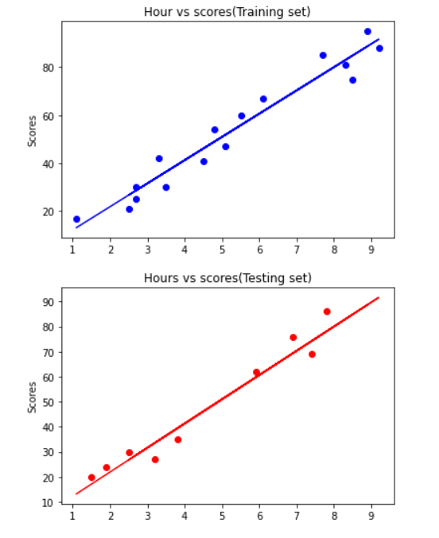

# Implementation-of-Simple-Linear-Regression-Model-for-Predicting-the-Marks-Scored

## AIM:
To write a program to implement the simple linear regression model for predicting the marks scored.

## Equipments Required:
1. Hardware – PCs
2. Anaconda – Python 3.7 Installation / Moodle-Code Runner

## Algorithm
1. Use the standard libraries in python for Gradient Design.
2. Set variables for assigning dataset values.
3. Import linear regression from sklearn.
4. Assign the points for representing in the graph
5. Predict the regression for marks by using the representation of the graph.
6. Compare the graphs and hence we obtained the linear regression for the
given datas

## Program:
```
/*
Program to implement the simple linear regression model for predicting the marks scored.
Developed by: K.M.SWETHA
RegisterNumber: 212221240055  
*/
import numpy as np
import pandas as pd
import matplotlib.pyplot as plt
dataset= pd.read_csv('student_scores.csv')
dataset.head()
X=dataset.iloc[:,:-1].values
X
y=dataset.iloc[:,1].values
y
from sklearn.model_selection import train_test_split
X_train,X_test,y_train,y_test=train_test_split(X,y,test_size=1/3,random_state=0)
from sklearn.linear_model import LinearRegression
regressor=LinearRegression()
regressor.fit(X_train,y_train)
y_pred=regressor.predict(X_test)
y_pred
y_test 
plt.scatter(X_train,y_train,color='blue')
plt.plot(X_train,regressor.predict(X_train),color='blue')
plt.title("Hour vs scores(Training set)")
#plt.xlabel("Hours")
plt.ylabel("Scores")
plt.show()
plt.scatter(X_test,y_test,color='red')
plt.plot(X_train,regressor.predict(X_train),color='red')#plotting the regression line
plt.title("Hours vs scores(Testing set)")
#plt.xlabel("Hours")
plt.ylabel("Scores")
plt.show()
```

## Output:



## Result:
Thus the program to implement the simple linear regression model for predicting the marks scored is written and verified using python programming.
